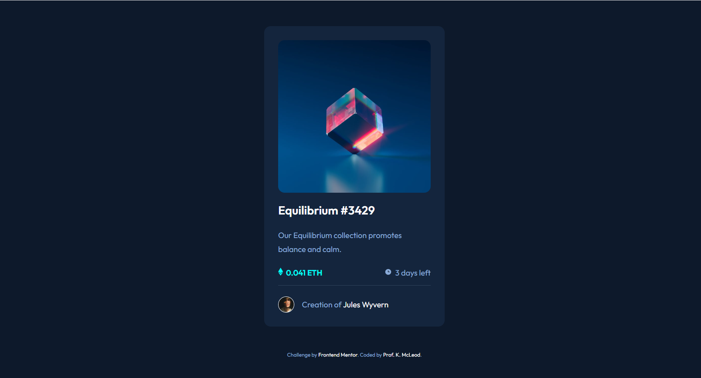
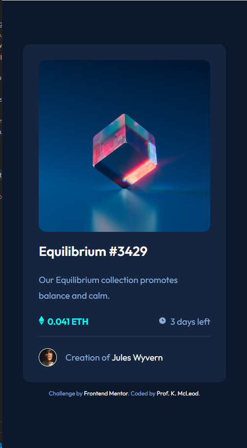

# Frontend Mentor - NFT preview card component solution

This is a solution to the [NFT preview card component challenge on Frontend Mentor](https://www.frontendmentor.io/challenges/nft-preview-card-component-SbdUL_w0U). Frontend Mentor challenges help you improve your coding skills by building realistic projects. 

## Table of contents

- [Overview](#overview)
  - [The challenge](#the-challenge)
  - [Screenshot](#screenshot)
  - [Links](#links)
- [My process](#my-process)
  - [Built with](#built-with)
  - [What I learned](#what-i-learned)
  - [Continued development](#continued-development)
  - [Useful resources](#useful-resources)
- [Author](#author)
- [Acknowledgments](#acknowledgments)

**Note: Delete this note and update the table of contents based on what sections you keep.**

## Overview

### The challenge

Users should be able to:

- View the optimal layout depending on their device's screen size
- See hover states for interactive elements

### Screenshot

### Links

- Solution URL: [View Solution](https://www.frontendmentor.io/solutions/nft-preview-card-using-flexbox-8nfYLNGu9b)
- Live Site URL: [View Live Site](https://profkmcleod.github.io/fm-nft-preview/)

## My process

### Built with

- Semantic HTML5 markup
- Flexbox
- Mobile-first workflow

### What I learned

The overlay methods found online were not intuitive for me. This caused me to explore blend modes and CSS more deeply.

### Continued development

There is intermittent screen flickering when I hover on the image. I would like to identify the reason for this.

### Useful resources

- [CSS Variables](https://www.w3schools.com/css/css3_variables.asp) - This helped me recall the syntax for CSS variables.
- [Google Font - Outfit](https://fonts.google.com/specimen/Outfit ) 
- [A Complete Guide to Flexbox](https://css-tricks.com/snippets/css/a-guide-to-flexbox/ ) - This is an excellent flexbox resource

## Author

- Frontend Mentor - [@profkmcleod](https://www.frontendmentor.io/profile/profkmcleod)

